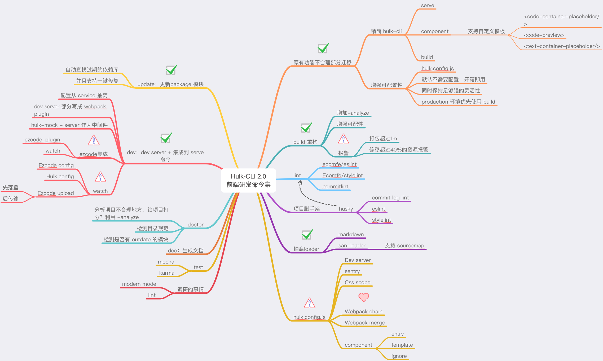

# Hulk cli - 前端研发命令集

-   [ ] css sprite
-   [ ] doc 命令
-   [ ] ezcode
-   [ ] test
-   [ ] sentry

## Hulk 2.0

解决问题：

1. 发现大家在使用 Hulk-CLI 创建了项目之后，需要升级配置的时候，需要挨个升级，很是麻烦；
2. 而且之前的脚手架存在多处配置问题，需要重新设计下架构；
3. 纳入 lint 命令；
4. 扩展 hulk.config.js；
5. 增加 modern mode 打包；
6. 拆分 loader 和 plugin，修复设计不合理的地方，比如 markdown-loader 配置问题，不支持模板定制问题。



## 开发

```bash
lerna bootstrap
```

## 发布

```bash
lerna publish --skip-git
```

## 测试

```bash
node packages/@baidu/hulk-cli/bin/hulk.js
```

## 二次编写

在 `packages/hulk-cli/commands/*` 添加命令，然后在`packages/hulk-cli/bin/hulk.js`添加入口，参考下面目录：

```
commands
├── init # 新增命令
│   ├── index.js # commander 配置
│   └── run.js   # action 实际代码
```

`index.js` 主要是 [commander](https://www.npmjs.com/package/commander) 配置

```js
// index.js 主要是 commander 配置，接收program配置
const run = require('./run');
module.exports = program => {
    program
        .command('update [path]')
        .description('执行npm outdated，升级目录下面的依赖')
        .allowUnknownOption()
        .action(run);
};
```

`run.js` 是项目实际的代码，接收`commander` `action`参数

> `run.js` 推荐用 import-lazy 来引入模块，尽量避免一开始就执行，不然会拖累 cli 的执行速度
