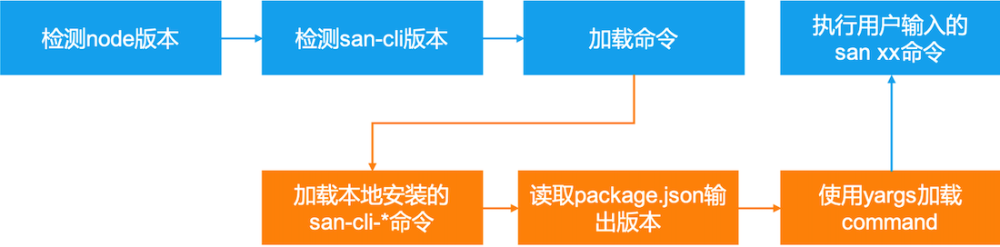

# 内部实现

San CLI 是一个命令行工具，其次它是一个内置 Webpack 的前端工程化构建工具。San CLI 在架构设计上采取了微核心和插件化的设计思想，我们可以通过插件机制添加命令行命令，还可以通过插件机制定制 Webpack 构建工具，从而满足不同 San 环境的前端工程化需求。

San CLI 在兼顾 San 生态的同时，尽量做到通用化配置，在设计之初，我们希望不局限于 San 的应用范畴，做可定制化的前端开发工具集。

下面分别从模块、命令行实现、脚手架和插件机制四大方面来介绍下 San CLI 的内部实现。

## 核心模块介绍


San CLI 的核心模块包含：

-   san-cli：核心模块，负责整合整个工作流程。
-   san-cli-utils：工具类
-   san-cli-service：service 层
-   san-cli-webpack：webpack build 和 dev-server 通用逻辑和 webpack 自研插件等
-   san-cli-config-webpack：生成打包配置
-   san-cli-init：init 命令，脚手架
-   san-cli-build：build 命令，生产环境打包
-   san-cli-serve：serve 命令，开发环境打包
-   san-cli-ui：ui 命令，可视化图形操作界面
-   san-loader：`.san`文件 webpack loader
-   san-hot-loader：给 san 组件添加 HMR 功能
-   san-cli-plugin-\*：对应 service 的 plugin
-   san-cli-ui-\*：对应 ui 的 plugin

结合模块的主流程可以如下图所示：


### san-cli-utils 重点方法介绍

utils 中用的最多的是`ttyLogger.js`中跟 tty 输出相关的函数，常见的有：

-   ora
-   chalk
-   logger
    -   log
    -   debug
    -   info
    -   done/success
    -   warning/warn
    -   error
    -   fatal
    -   time/timeEnd：用于检测时间段耗时，需要配合`DEBUG=san-cli:perf`环境变量使用

San CLI 中的 logger 是通过自定义的 Consola Reporter 实现的，在插件中也可以直接调用这些方法使用。

> 如果要使用彩色突出显示 San CLI 的终端内容，强烈建议使用`randomColor.js`中的`textColor`和`bgColor`两个方法。

### san-cli-webpack 模块介绍

为了方便 Webpack 打包命令和 dev-server 相关的代码逻辑复用，我们将`build`和`serve`用到的两个方法进行了统一封装，继承自`EventEmitter`，本身具有事件机制，webpack打包的状态结果通过complete、success、fail事件传递。该模块包含了下面 Webpack 相关插件：

-   `lib/formatStats.js`：在`build` 之后分析`Stats`对象，在终端中输出分析结果；
-   `lib/HTMLPlugin.js`：html-webpack-plugin 的插件，给 html 页面增加打包后的 bundle 和在 head 中增加`preload`和`prefetch`的`meta`；（主要增加对 smarty 的支持）；
-   `lib/ModernModePlugin.js`：modern mode 打包插件；
-   `lib/SanFriendlyErrorsPlugin.js`：扩展 friendly-errors-webpack-plugin 的错误类型，统一终端 log。

另外`utils.js`里面有一些工具函数可能在二次开发中会用得到。

## 核心概念介绍

为了方便理解下面的内容，在介绍 San CLI 的工作流程之前，先介绍下 San CLI 的核心概念：

1. 流程：CLI 的流程分为两段，主流程和 Service 流程；
    1. 主流程：`index.js`的流程，是整个 CLI 的工作流程，自动查找以`san-cli-*`为前缀的包，加载并执行对应的命令，每个命令会首先实例化 Service，进入 Service 流程；
    2. Service 流程：CLI 的 Service 层设计，主要进行 Webpack 构建相关的处理逻辑；
    3. P.S：`build`、`serve`都是走的 Service 流程。
2. Service：CLI 的 Service 层设计，主要进行 Webpack 构建相关的处理逻辑；在其中会通过调用`san-cli-config-webpack`加载内置及用户自定义的配置，生成 Webpack 所需的配置文件。
3. Service 插件：Service 层的插件。

## 主流程：命令行实现

San CLI 的命令行使用了[yargs](https://github.com/yargs/yargs/)。通过查找本地已安装的`san-cli-*`命令包将方法和属性到`argv`对象中，并执行对应的命令。

整个 CLI 的工作流程在`index.js`中，大致流程如下：

1. 检查 node 版本；
2. 添加最新版本检查器；
3. 加载并执行已安装的命令（`init`、`build`、`serve`、`ui`等）：通过实例化 Service，执行`Service.run(commandName, argv)`；



## san-cli-init：脚手架实现

项目脚手架初始化是在`san-cli-init`中实现的，原理是通过 git 命令拉取对应 github/icode/gitlab 等脚手架模板的 repo 到本地，然后使用[vinyl-fs](https://github.com/gulpjs/vinyl-fs)依次将文件进行处理后生成项目代码。

`san-cli-init`的核心是一个`TaskList`类，通过四步串行任务完成：

1. 检查目录和离线包状态：检查模板的本地路径和离线包是否可用；
2. 下载项目脚手架模板：从 github 等线上下载模板到 user-home 的模板缓存路径；
3. 生成项目目录结构：使用`vinyl-fs`把模板从缓存目录遍历处理到对应的项目目录；
4. 安装项目依赖：询问是否安装`package.json`的依赖。

## 插件机制

San CLI 支持 Service 插件。
### Service

San CLI 在实现可扩展 Webpack 配置的设计上，借鉴了 Vue CLI 的 Service 机制。

Service 的使用方式如下：

```js
const service = new Service(name, {
    // cwd 目录
    cwd,
    // config 文件路径
    configFile,
    // 是否 watch
    watch,
    // mode production/development
    mode,
    // 是否使用内置 Plugin
    useBuiltInPlugin,
    // 优先级比 san.config.js 低
    projectOptions,
    // 传入的插件 list
    plugins,
    // 是否使用 progress
    useProgress,
    // 是否使用 Profiler
    useProfiler
});
// 开始执行，执行结果回调，callback 传入 PluginAPI 实例
service.run(callback);
```

现在以`san serve`命令执行流程为例，讲解下整个工作流程：

1. 首先 CLI 通过主流程加载并执行命令，进入`san-cli-serve`的 handler；
2. handler 主要是实例化 Service，实例化会将配置项和插件进行处理
3. 然后执行`service.run(callback)`，进入 service 流程，这部分代码主要在`service.run`中：
    1. 添加内置的plugin
    2. 执行`init`：
        1. `loadEnv`：加载 env 文件；
        2. `loadProjectOptions`：加载`san.config.js`；
        3. 添加用户的plugin
        4. 初始化插件，并且依次执行；
        5. 依次执行 webpackChain 回调栈；
        6. 依次执行 webpackConfig 回调栈；
    3. 返回service实例对象
4. 执行 `callback`。


> **webpackChain 回调栈**存储的是接收[webpack-chain](https://github.com/neutrinojs/webpack-chain)格式的 webpack 配置文件的处理函数；
> **webpackConfig 回调栈**存储的是接受普通 webpack 配置文件对象的处理函数。
> P.S：handler 中可以通过 service 插件的 API 获取最终的 webpack config，然后结合`san-cli-webpack`的`build`/`serve`执行对应的打包操作。

#### Service 插件

插件的定义方法如下：

```js
module.exports = {
    id: 'plugin-id',
    apply(api, projectOptions, pluginOptions) {
        api.chainWebpack(webpackConfig => {
            console.log(projectOptions);
            webpackConfig.entry(/*...*/);
        });
    },
    ui() {}
};
```

#### Service Plugin 流程


#### Service 插件 API

属性：

-   `.id`：插件 id；
-   `.service`：service 实例；
-   `.log/logger`：日志对象，包含 debug/done/error/warn/log/fatal/trace/time/timeEnd/textColor/bgColor 等；
-   `.version`：San CLI 版本号。

常见方法包括：

-   `.isProd()`：是不是生产环境打包，`process.NODD_ENV==='production'`；
-   `.configWebpack(fn)`：将`fn` 压入 webpackConfig 回调栈，`fn`会在出栈执行时接收 webpackConfig，用于修改 webpack config；
-   `.chainWebpack(fn)`：将`fn` 压入 webpackChain 回调栈，`fn`会在出栈执行时接收 chainableConfig，用于 webpack-chain 语法修改 webpack config；
-   `.resolve(p)`：获取 CLI 执行目录的完整路径；
-   `.getWebpackChainConfig()`：获取 webpack-chain 格式的 config；
-   `.getWebpackConfig([chainableConfig])`：将传入的 webpack-chain 格式 config 处理成 webpackConfig 返回；
-   `.getCwd()`：获取 CLI 的执行目录；
-   `.getVersion()`：获取 CLI 版本；
-   `.getPkg()`：获取当前项目`package.json`内容；
-   `.addPlugin(plugin, options)`：添加插件；
-   `.middleware()`：添加 dev-server 中间件，**这里注意：中间件需要使用 factory 函数返回**

**`.middleware()`示例：**

```js
api.middleware(() =>
    // return 一个 Expressjs 中间件
    require('hulk-mock-server')({
        contentBase: path.join(__dirname, './' + outputDir + '/'),
        rootDir: path.join(__dirname, './mock'),
        processors: [
            `smarty?router=/template/*&baseDir=${path.join(__dirname, `./${outputDir}/template`)}&dataDir=${path.join(
                __dirname,
                './mock/_data_'
            )}`
        ] // eslint-disable-line
    })
);
```

> P.S：Service 是继承`EventEmitter`的，具有事件机制，不过目前还没有使用，sad~。
