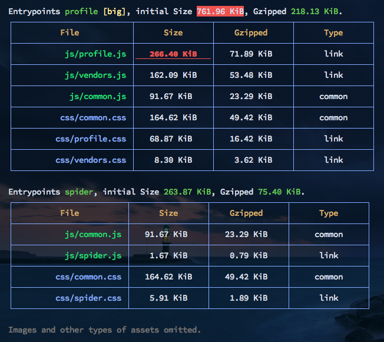

# 生产打包

`san build`是生产环境打包，下面详细说下用法。

## 使用命令

```bash
san build [entry]
```

-   entry：入口文件，用于编译单一文件，不传入，则从当前[工作目录](https://zh.wikipedia.org/wiki/%E5%B7%A5%E4%BD%9C%E7%9B%AE%E9%8C%84)，读取 Config 文件的 pages 配置项

打包结束之后，build 命令默认会生成产出物报表，效果如下：



## 参数说明

### 性能相关

-   `--modern` 是否使用 modern mode 打包，值为 true 或 false，默认是 false，modern mode[参考](/modern-mode.md)

### 配置相关

-   `--dest` 产出文件目录
-   `--mode，--m` 环境指示，值为 development 或 production，默认是 production
-   `--config，--config-file` 指定 san config 内容，值为 san config 文件的地址，默认会从目录中找寻 san.config.js 文件

### 报告和日志相关

-   `--analyze，--analyzer`：是否使用 webpack-bundle-analyzer 输出包分析，值为 true 或 false，默认 false
-   `--profile`：是否展示编译进度日志，值为 true 或 false，默认是 false
-   `--report`：是否输将包分析报表生成为单个 HTML 文件，值为 true 或 false 或者文件名，默认 false，仅生成 Webpack Stats JSON 文件
-   `--stats-json，--statsJson`：是否输将包分析报表生成为 stats.json，值为 true 或 false 或者文件名，默认是 false
-   `--no-colors`：是否展示无色彩 log，值为 true 或 false，默认是 false

### 其他

-   `--watch，--w` 是否监听代码变化
-   `--remote` 将编译产出远程部署到目标机器的名称，具体使用可参考[文档](/deployment.md)
