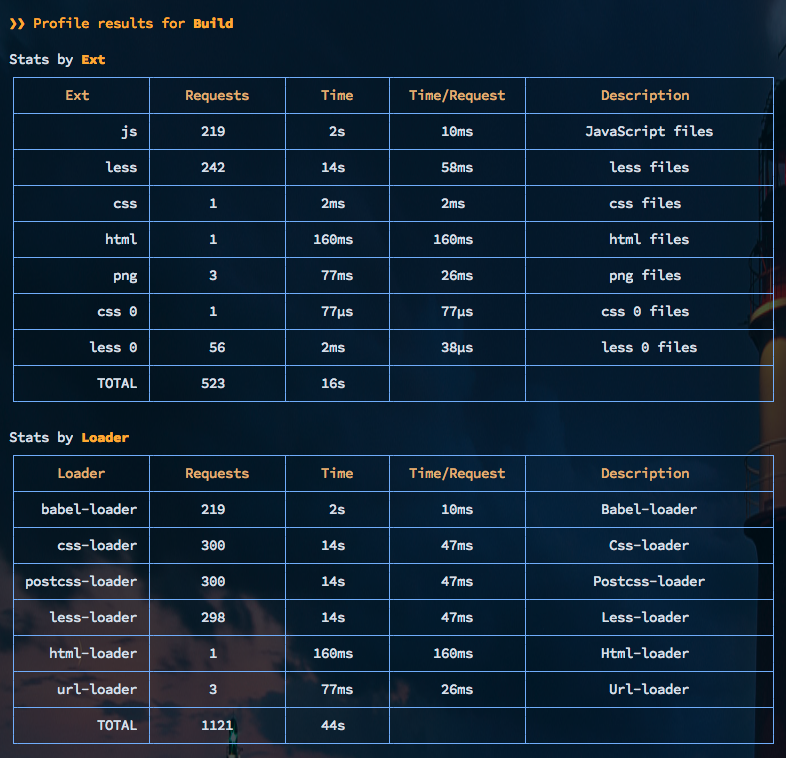

# Bundle 分析

很多团队在使用 Webpack 的时候，不注意关注打包后的性能问题，而使用[webpack-bundle-analyzer](https://github.com/webpack-contrib/webpack-bundle-analyzer/)可以帮忙排查打包不合理的情况，一般会遇见下面的问题：

1. 打入不必要的包，引入过多的内容，比如`lodash`，需要使用`lodash` babel 插件来解决；
2. 打包优先级错误，导致本来不需提前引入的包，可以使用动态加载的方式来引入；
3. 多页面情况下没有拆包，每个页面一个包，这种情况可以使用`spiltChunks`来进行拆包，将公共内容拆成一个包。

San CLI 内置了[webpack-bundle-analyzer](https://github.com/webpack-contrib/webpack-bundle-analyzer/)，使用方便，只需要在执行`san build`时加上`--analyze`

## 分析结果

除了直接使用 webpack-bundle-analyzer 查看 Bundle 结果，还可以将结果保存下来，用于分析和比较两次打包的结果，查看是否打包合理，San CLI 的 build 使用下面的两个参数来将分析结果进行保存：

-   `--stats-json，--stats`：生成 Webpack stats JSON 文件到 stats.json
-   `--report`：将包分析报表生成为单个 HTML 文件

关于 Bundle 结果的分析可以查看[这篇文章](https://survivejs.com/webpack/optimizing/build-analysis/)，介绍了很多 Bundle 分析工具。这些工具的使用方法都是将生成的 JSON 文件上传上去，然后分析，这里就不再赘述了。

## 打包性能分析

如果需要排查 loader 或者 plugin 的性能问题，可以使用 `san build --profile`，然后打包时会出现对应的性能表格。

