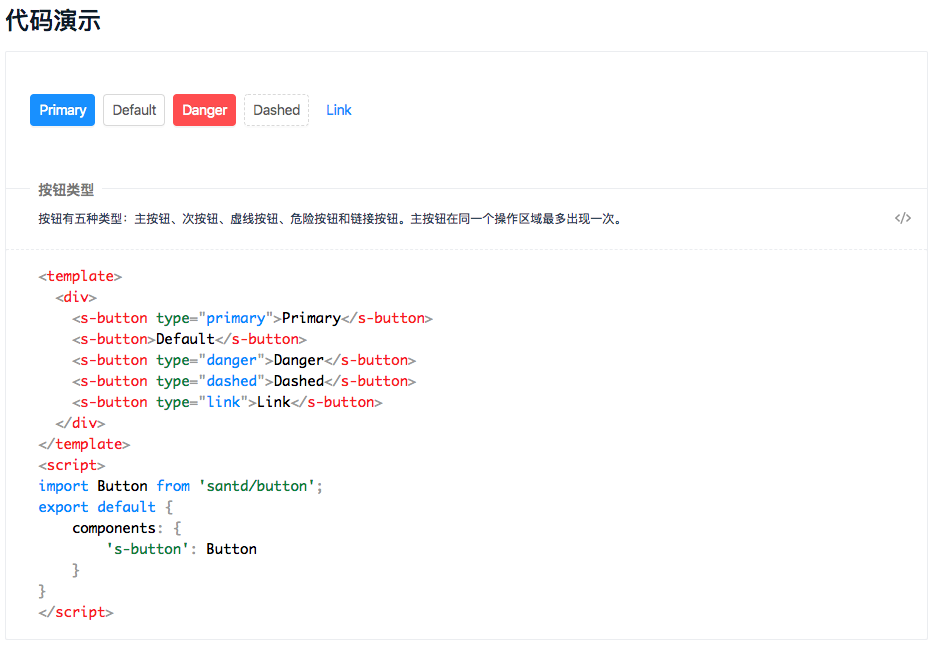
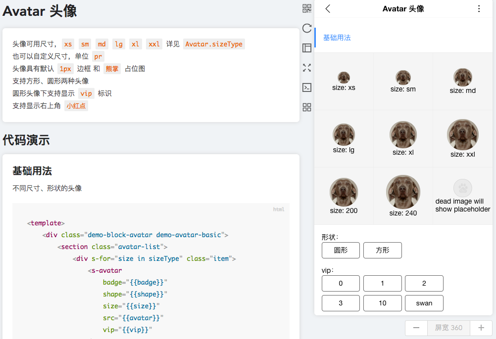

# 在 Markdown 中执行 San 代码

在 Markdown 中是可以运行 San 代码的，即 San 代码是直接可以被执行，并且显示结果。这个功能常用在 Component 的文档编写中，我们在写 Component 时，经常遇见的问题就是写完组件还需要写个「测试页面」来查看 Demo 效果，测试没问题了之后，还需要写组件文档，在 San docit 中，**文档即 Demo**！

## `<sanbox>` 基本语法

在 Markdown 中使用`<sanbox>`标签包裹下面的代码

````markdown
:::
#### 我是 title

这是是描述的内容
:::

```html
<template>
    <div id="hello-demo">
        <hello />
        <h2>{{text}}</h2>
    </div>
</template>
<style lang="less">
    @red: red;
    #hello-demo {
        h2 {
            color: @red;
        }
    }
</style>
<script>
    import Hello from './component.js';
    export default {
        initData() {
            return {
                text: '这里是副标题'
            };
        },
        components: {
            hello: Hello
        }
    };
</script>
```

````

语法分为：描述语法和代码语法

### 1. 描述语法

```markdown
:::
#### 我是 title，只能用 h4

这是是描述的内容，一句话
:::
```

支持多语言版本，例如`cn`：

```markdown
::: cn
#### 中文，只能用 h4

这是是描述的内容，一句话
:::
```
需要配合`markdown-loader`的`i18n`配置来解析出对应的内容。

### 2. 代码语法
代码语法是使用代码区块（fence语法）来实现的，可以直接写 San 文件，在代码中可以直接`import`某个js 文件，还可以通过配置`san.config.js`的`alias`来方便引入。

### 下面是 Santd 的 SanBox 截图



## 如何将文档 Demo 单独提取到一个页面

还有一种情况是做移动端页面 Demo，需要在 PC 文档网站做个模拟器，例如我们使用`REM+VW`切图，用到了 REM，如果 PC 网站设置了 HTML 的`fontSize`那么整个 PC 网站样式都会有问题，这时候需要创建个类似手机的区域，然后使用`iframe`引入对应的 Demo 页面，下面图片是我们内部移动端 C 端头像组件文档效果：



这时候可以在 js 文件中直接手动引入对应的 Markdown 文件，并且在文件后面添加参数`?san-md&type=sanbox&index=${idx}`。

* type：写死是`sanbox`，说明需要的是文档中解析出来的`sanbox`标签内容；
* index：一个Markdown 中有多个 sanbox，则可以通过`index`精准选择其中一个 sanbox。

`import SanBox from 'x.md?san-md&type=sanbox&index=1'` 得到的是一个 San Component。这样我们就可以写自己的移动端页面Demo了。
