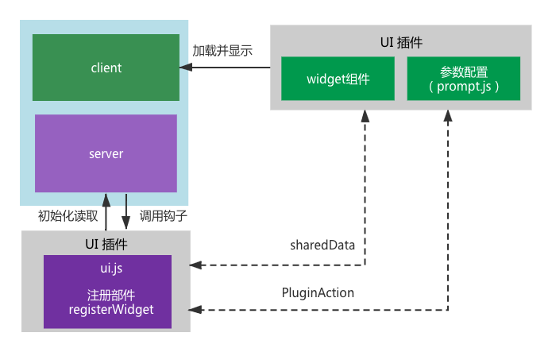

# widget部件

仪表盘部件的工作流程：



前文提到的插件包的目录结构：

```js
.
├── README.md
├── src
│    └── index.js // 组件注册
├── package.json
└── ui.js         // `San CLI UI` 集成（这里存放插件的配置信息）
```

实现一个显示在仪表盘的小部件，在ui.js内主要借助两个api：

- `api.registerAddon`：注册插件的id并且定义加载的路径。
- `api.registerWidget`：注册一个widget部件，返回小部件的具体配置。

在client端通过`ClientAddonApi`加载组件定义并挂载到仪表盘视图内，因此在index.js内需要用到:

- `ClientAddonApi.defineComponent`：组件定义
- `ClientAddonApi.addLocales`：组件扩展语言

## widget插件开发

`San CLI UI`提供了将自定义组件挂载到项目仪表盘的方式，通过此功能，你可以定制属于自己的个性仪表盘，也可将小工具分享给更多的人使用。

插件的实践中，我们将演示一个自定义部件的实现，并显示在仪表盘显示的过程。
将新增部件分为三步：**创建工程**->**本地调试**->**发布安装**

### 创建工程

我们提供了插件创建的脚手架来简化插件的创建过程，脚手架推荐：

- 插件脚手架：https://github.com/jinzhan/san-cli-plugin-template.git 
- UI插件脚手架：https://github.com/zttonly/san-ui-addon-project.git

在脚手架中预置了插件相关的基础配置，当然用户也可以根据自身习惯，创建自己的脚手架工程。

这里我们使用UI插件脚手架，创建一个名为`san-cli-ui-widget-hello`的工程，使用`San CLI UI`的创建项目功能，在脚手架地址输入`San CLI UI`插件脚手架地址，按照步骤执行，完成创建。过程演示如下：


在新创建工程的目录中关键的文件：`san.config.js`、`ui.js`、`src/index.js`中已包含了默认配置，开发者直接修改其中的名称即可。

新建的插件包目录结构如下：

```js
san-cli-ui-widget-hello
├── README.md
├── src
      ├──components
│     └── index.js
├── package.json
├── san.config.js
└── ui.js         // San UI 集成（这里存放插件的配置信息）
```

我们逐一来看

在插件工程的`san.config.js`中已预置了由`San CLI UI`提供的默认配置，通过`clientAddonConfig`可生成`san.config.js`的默认配置，打包出的代码输出到`./dist/index.js`。：

```js
const clientAddonConfig = require('san-cli-ui/client-addon-config');

module.exports = {
    ...clientAddonConfig({
        id: 'san.webpack.client-addon.san-cli-ui-widget-hello', // 名称唯一
        port: 8890 // 端口可变
    })
};
```

> 注意：
> id应设置正确的命名，且在所有插件中保持唯一；
> port是本地服务的端口，可修改，但应与ui.js文件中本地服务url保持一致


`ui.js`文件已预置了插件加载路径定义和widget部件定义：

```js
module.exports = api => {
    // 注册组件加载路径 区分生产环境和开发环境
    if (process.env.SAN_CLI_UI_DEV) { // 开发环境
        api.registerAddon({
            id: 'san.widget.san-cli-ui-widget-hello.client-addon.dev',
            url: 'http://localhost:8890/index.js' // 开发环境地址，也即本地服务地址
        });
    }
    else { // 生产环境
        api.registerAddon({
            id: 'san.widget.san-cli-ui-widget-hello.client-addon', // 唯一id，推荐增加类型前缀'san.widgets'
            path: 'san-cli-ui-widget-hello/dist' // 生产环境指向本插件包的编译产出地址
        });
    }
    // 接下来注册widget
    api.registerWidget({
        id: 'san.san-cli-ui-widget-hello.widget-demo', // 命名不重复即可
        title: 'san-cli-ui-widget-hello.title', // locales定义的文案
        description: 'san-cli-ui-widget-hello.description',
        icon: 'smile', // santd的icon类型
        component: 'san.widget.components.widget-demo', // 指定显示的组件id, 值对应src/index.js注册的组件名
        // 接下来具体组件的配置信息
        minWidth: 2,
        minHeight: 2,
        maxWidth: 2,
        maxHeight: 2,
        maxCount: 1
    });
};
```

> 注意开发环境下的url`http://localhost:8890/index.js`其中端口应与san.config.js端口一致

在`src/index.js`中也定义了一个显示在client端的组件：

```js
import widgetdemo from './components/widget-demo';
import locales from './locales.json';

/* global ClientAddonApi */
if (window.ClientAddonApi) {
    // 扩展语言
    ClientAddonApi.addLocales(locales);
    // 推荐以类型前缀定义组件的唯一id：'san.widget'
    ClientAddonApi.defineComponent('san.widget.components.widget-demo', widgetdemo);
}

```

其中的`widgetdemo`是按照san组件规范定义的一个san组件，在`San CLI UI`中扩展了santd组件预置，因此可直接使用santd组件，无需重复定义，例如santd的icon组件`<s-icon />`：

```js
export default {
    template: `
        <div class="widget-demo">
            <div>{{hello}}</div>
            <div>{{$t('san-cli-ui-widget-hello.welcome')}}</div>
            <s-icon type="file" style="font-size: 32px"/>
        </div>
    `,
    initData() {
        return {
            hello: 'hello san ui widget'
        };
    }
};

```

在开发addon组件过程中，会涉及到以下api：

- `api.registerAddon`：addon组件注册
- `api.registerWidget`：widget部件注册
- `api.callAction`：事件调用
- `api.onAction`：事件监听
- `ClientAddonApi.defineComponent`：组件定义
- `ClientAddonApi.addLocales`：组件扩展语言

组件实现可参考[文档](https://ecomfe.github.io/san-cli/#/ui/start)以及已有插件[图片压缩插件](https://github.com/amazing-js/san-cli-ui-widget-tiny-image)


### 本地调试

#### 1. 启动本地服务
在`san-cli-ui-widget-hello`插件工程中执行`npm start`或在`San CLI UI`启动的界面中，打开`san-cli-ui-widget-hello`工程，点击任务管理->start任务->运行，来启动start任务。

#### 2. 修改插件的ui.js
这步主要是将加载环境置为开发环境，暂时注释掉生产环境的加载条件判断：

```js
module.exports = api => {
    // 注册组件加载路径 区分生产环境和开发环境
    // if (process.env.SAN_CLI_UI_DEV) { // 开发环境
        api.registerAddon({
            id: 'san.widget.san-cli-ui-widget-hello.client-addon.dev',
            url: 'http://localhost:8890/index.js' // 开发环境地址，也即本地服务地址
        });
    // }
    // else { // 生产环境
    //     api.registerAddon({
    //         id: 'san.widget.san-cli-ui-widget-hello.client-addon', // 唯一id，推荐增加类型前缀'san.widgets'
    //         path: 'san-cli-ui-widget-hello/dist' // 生产环境指向本插件包的编译产出地址
    //     });
    // }
    ...
};
```

#### 3. 在调试工程中加入新插件的依赖
现在我们已经有了一个插件工程`san-cli-ui-widget-hello`。

找到一个本地san工程用于调试，例如名称为`san-local`，在`san-local`的package.json增加插件依赖:

```json
// package.json
{
  "name": "san-local",
  ...
  "devDependencies": {
    "san-cli-ui-widget-hello": "file:../san-cli-ui-widget-hello",
    ...
  },
  "dependencies": {
  }
}
```

注意这里采用的是本地文件的方式。

#### 4. 调试工程内安装插件
在`san-local`工程内执行`npm i`，安装新添加的依赖。

#### 5. 查看效果

依赖安装完成，在`San CLI UI`界面中打开`san-local`工程的仪表盘即可看到效果。


### 发布安装

`san-cli-ui-widget-hello`调试完毕后，恢复`ui.js`内注释的内容，执行`npm run build` + `npm publish`完成包的发布。

在`San CLI UI`的插件管理中搜索到刚发布的插件，安装后即可使用了。
