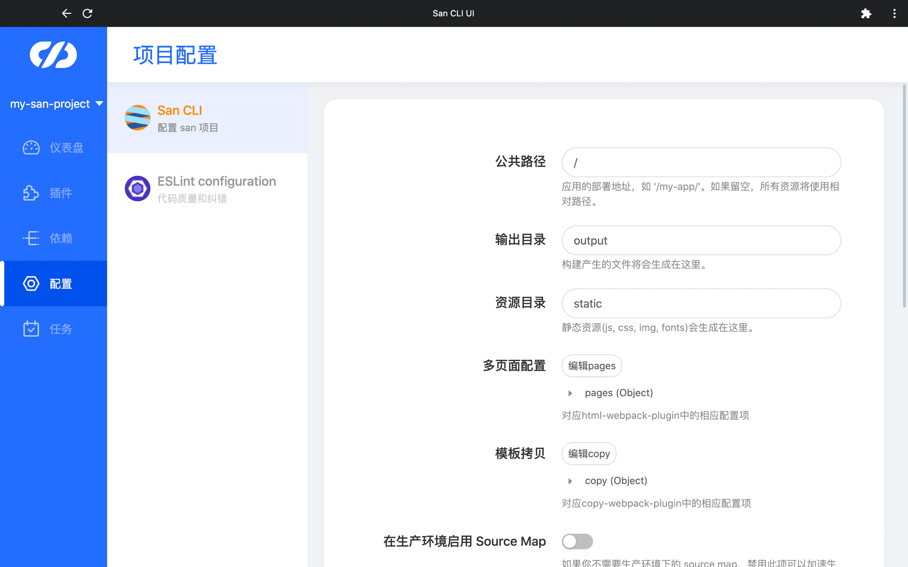

# 配置管理

`San CLI` 的配置文件为`san.config.js`，该文件放在项目的根目录下，当执行 `San CLI` 命令时，`San CLI` 会自动读取`san.config.js`的内容，在项目创建后，首先需要修改`san.config.js`来配置文件打包等选项。`San CLI UI` 将配置的每一项转换为表单，同时将配置项的语义直观的展示在页面，无需查找文档，直接在`San CLI UI`中修改表单，保存后即可看到`san.config.js`对应位置的修改。

在`San CLI UI`中，通过配置管理来集中查看、修改项目的各种配置文件。默认的可进行管理的配置文件有 san 项目配置文件和 eslint 配置文件。当然也支持用户定义其他可配置项，配置的自定义参见插件开发部分。

