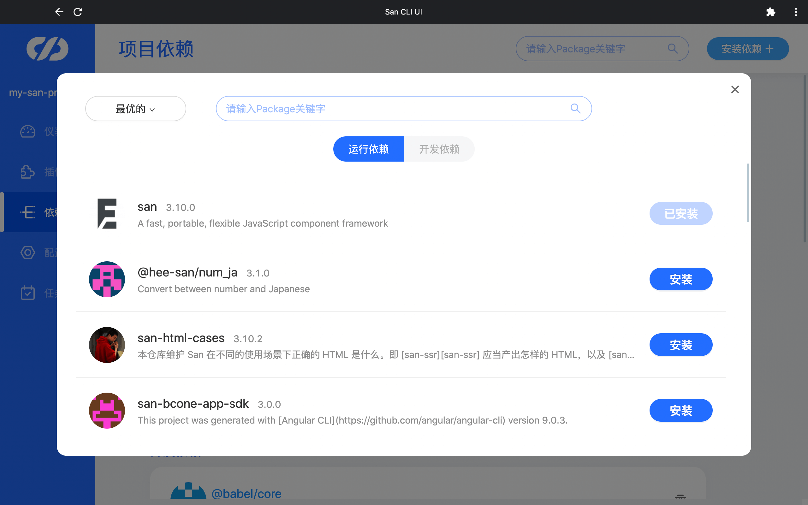

# 依赖管理与插件管理

在`San CLI UI`中，可直接进行项目插件和依赖的安装、更新、卸载、删除等操作，依赖管理和插件管理的核心是npm包的安装可视化操作，好处是：

- npm install的可视化管理，组件升级更直观
- 操作简单，快速引入依赖
- CLI的插件集合，更容易发现新包，提升检索效率

## 依赖管理

在依赖管理中，可以查看项目已安装的依赖列表，也可以在上方的搜索框中搜索项目已安装的依赖，然后更新或卸载它们。

### 安装依赖

点击右上角的“安装依赖”按钮后，可以根据关键词搜索所有已发布的 npm 包，并且按不同方式对搜索结果进行排序，然后选择包进行安装。

