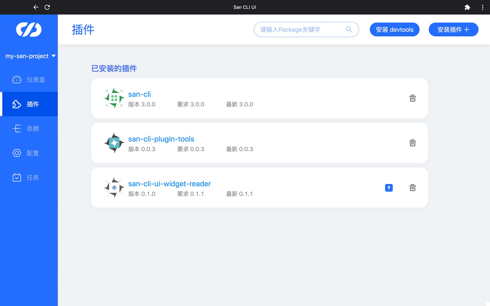
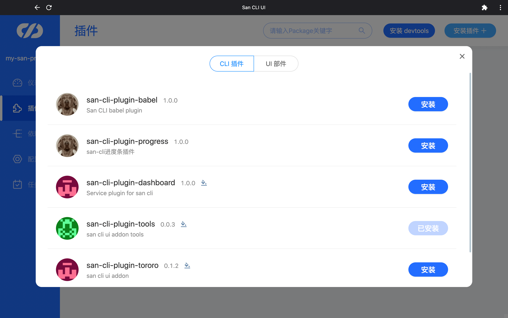

# 插件管理

在插件管理，可以查看项目已安装的插件列表，也可以在上方的搜索框中搜索项目已安装的插件，然后更新或卸载它们。

## 安装插件

点击右上角的“安装插件”按钮后，我们可以浏览所有的插件，这里我们将`San CLI`插件和`San CLI UI`插件进行了分类展示，提升搜索效率。

## 安装 devtools

右上角还提供了安装 devtools 的快捷入口。
注：devtools 是用于调试 san.js 应用的开发工具。

配置和依赖确认完毕后，接下来需要启动本地服务进行调试了。
