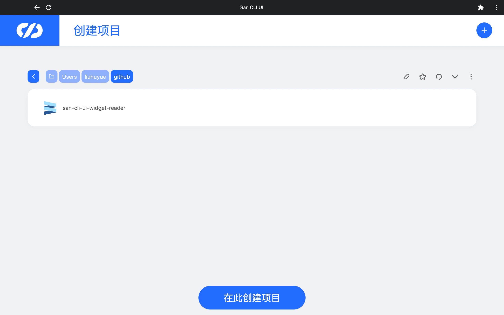
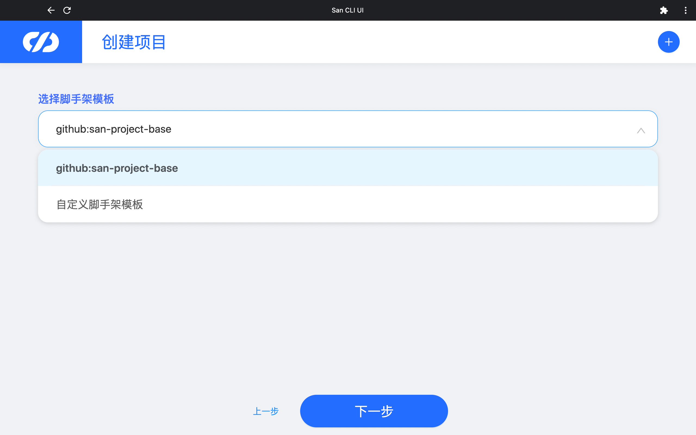
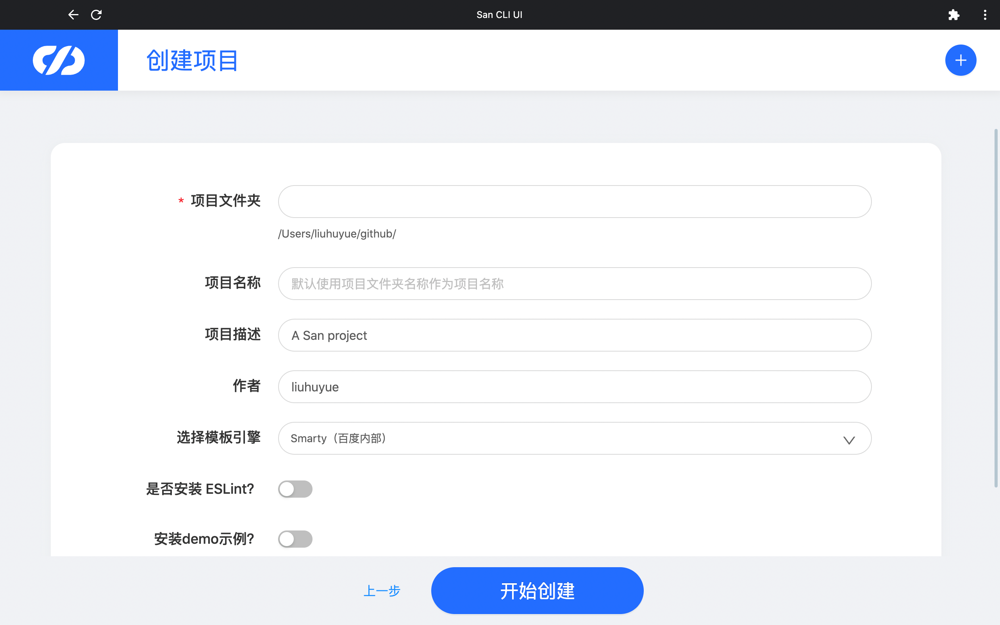
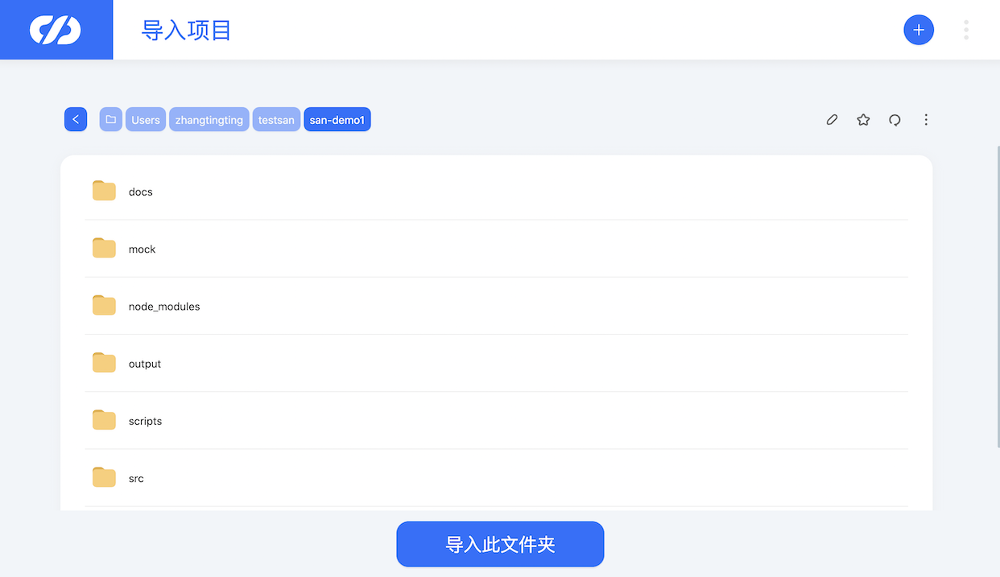

# 项目创建

点击顶部导航右上角"+"按钮，可进入创建项目页。

主要操作步骤：
- 选择目录：首先在本地文件浏览器中选择需要创建项目的目录，点击创建

- 选择模板：可选择预置脚手架或自定义脚手架

- 输入配置：输入项目需要的初始化信息

- 依赖安装：配置完成后系统会自动执行依赖安装
- 创建完成

`San CLI UI`中的**文件浏览器**可实现功能：
- 目录切换：可以通过点击路径切换，或者直接点击编辑后输入本地路径
- 目录收藏：对本地路径进行收藏，会进入收藏列表，下次可快速切换
- 新建文件夹：最右侧点击更多，可新建文件夹及显示隐藏文件

## 项目导入

项目导入功能主要用于将已创建的san项目导入到`San CLI UI`的工作台。

点击顶部导航右上角"+"按钮，可进入导入项目页。

在本地文件浏览器中选择需要导入项目所在的目录，点击导入此文件夹。

至此工程创建完毕，接下来我们首先要做的就是修改项目的配置，并在本地运行。
