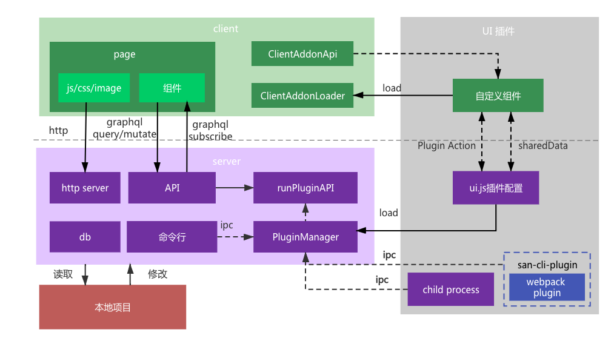

# San CLI UI 工作流程

在介绍插件开发之前，我们首先了解一下`San CLI UI`的工作流程。



如图所示`San CLI UI`数据流程，`San CLI UI`的架构设计参考了[`Vue CLI UI`](https://cli.vuejs.org/dev-guide/ui-api.html)，在实现上整体可以分为三部分：client端（也即浏览器端），server端（服务端），数据存储。
前后端的通讯主要通过graphql实现，而插件的加载主要通过插件系统。

图的右侧是插件包示意图，插件内主要包含两部分：用于`San CLI UI`的client端加载的前端组件，以及用于node端读取的ui.js插件配置。
在`San CLI UI`启动后，首先调用plugin初始化方法，加载全部的内置插件及用户开发的插件，在client端通过`ClientAddonApi`注册并加载对应的组件，在server端则通过pluginManager读取各个插件包内ui.js描述的插件配置，在操作中涉及到对项目的配置，则会操作本地项目进行读取并修改。

## San CLI UI插件系统

在`San CLI UI`中，仪表盘、配置管理、任务管理都是基于插件系统实现的，我们先来了解一下插件系统的相关概念。

### 插件系统的概念

**定义**

`San CLI UI`插件是一个动态加载到`San CLI UI`中的JS包，能够为`San CLI UI`创建的项目添加额外的功能

**插件的命名**

为便于识别，插件包应以`san-cli-ui-<type>-<name>`作为的格式命名，这样做不仅便于San CLI UI识别，同时便于其他开发者搜索发现。

**npm包基本结构**：

如下所示，除满足一个npm包的基本要求外，每个插件需要包含一个ui.js文件，用于导出插件的相关配置信息

```js
.
├── README.md
├── src
│    └── index.js // 组件注册
├── package.json
└── ui.js         // `San CLI UI` 集成（这里存放插件的配置信息）
```

其中最主要的两个文件：
- ui.js：用于server端插件的加载定义及描述，包含插件配置及数据操作的逻辑
- index.js：用于client端组件的定义

**San CLI UI插件加载关键**

`San CLI UI`插件加载依赖于server端和client端的两个对象的配合，首先在server端加载插件的描述，将插件的id及路径返回到client端，client端负责加载并挂载组件到页面：

- 在server端，由ui.js定义加载各类型插件和路由。通过api.registerAddon定义插件id及加载路径，api.register*定义插件所在视图
- 在client端，由index.js定义挂载到页面的组件。通过ClientAddonApi将组件挂载到页面

**ui.js文件配置**

在每个安装好的 `San CLI UI` 插件里，`San CLI UI` 都会尝试从其插件的根目录加载一个可选的 `ui.js` 文件。(也可以使用文件夹形式，例如 `ui/index.js`)。

`ui.js`主要导出一个函数，函数会以 API 对象作为第一个参数：

```javascript
module.exports = api => {
  // 在这里使用 API...
}
```

其中`api`由`San CLI UI`传入，为`PluginManager`的实例，所有插件的扩展功能都是基于这个对象来实现，例如：`api.registerConfig` 注册配置项、`api.registerWidget`注册widget部件、`api.registerAddon`注册插件id及加载路径等。

**index.js**

在用户自定义插件中，index文件主要负责自定义组件的注册，以便后面加载并显示在`San CLI UI`中，例如欢迎部件的定义：

```js
import Welcome from './components/welcome/welcome';
/* global ClientAddonApi */
if (window.ClientAddonApi) {
    ClientAddonApi.defineComponent('san.widgets.components.welcome', Welcome);
}
```

其中`ClientAddonApi`为ClientAddon的实例，在`San CLI UI`启动时，通过实例化ClientAddon将ClientAddonApi挂载至全局，供插件加载使用。


接下来将逐个讲解服务端对应的`PluginManager`对象及客户端对应的`ClientAddon`对象
